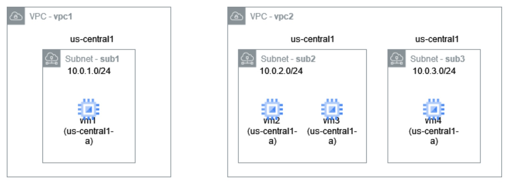

# Network Principles in Practice: Cloud Networking

## Module: Virtual Private Cloud (VPC)

### Assignment Overview

In this lab, you will use Terraform to build the following infrastructure:

- **VPCs and Firewalls**: 
  - Two VPCs, `tf-mod2-lab1-vpc1` and `tf-mod2-lab1-vpc2`.
  - Each VPC should have a corresponding firewall rule: `tf-mod2-lab1-fwrule1` for `vpc1` and `tf-mod2-lab1-fwrule2` for `vpc2`.
  - Firewall rules should allow ICMP, and TCP traffic on ports 22 and 1234 from any source (0.0.0.0/0).

**Note**: All resource names in Terraform should be prefixed with `tf-mod2-lab1-`. For example, `vpc1` should be named `tf-mod2-lab1-vpc1`.

### Infrastructure Diagram



For a detailed diagram of the setup, refer to the `mod2-setup.xml` file on [diagrams.net](https://app.diagrams.net/).

### VM Metadata Setup

For `vm1` and `vm2`, use the following startup script to install necessary utilities:

```hcl
metadata = {
  startup-script = "sudo apt update; sudo apt install -y netcat-traditional ncat;"
}
```

### Preparing to Collect Output

This lab includes a series of steps and queries to perform, with the output used to answer questions on the Coursera site.

### Steps After Terraform Apply

1. **Ensure `jq` is installed**:
   - [jq Installation Guide](https://jqlang.github.io/jq/)

2. **Export the Terraform state to JSON**:
   ```bash
   terraform show --json > terraform_show_output.json
   ```

3. **Find the Internal and External IP Addresses of VMs**:
   - **Google Cloud Console**: You can find IP addresses directly in the console.
   - **Using `jq`**:
     - **External IP of `vm1`**:
       ```bash
       jq '.values.root_module.resources[] | select(.address == "google_compute_instance.tf-mod2-lab1-vm1") | .values.network_interface[] | select(.name == "nic0") | .access_config[].nat_ip' terraform_show_output.json
       ```
     - **Internal IP of `vm1`**:
       ```bash
       jq '.values.root_module.resources[] | select(.address == "google_compute_instance.tf-mod2-lab1-vm1").values.network_interface[0].network_ip' terraform_show_output.json
       ```

### Connectivity Tests

1. **Ping Test**:
   - On `vm1`, ping the external and internal IP addresses of `vm2`.
   - On `vm2`, ping the internal IP address of `vm4`.

2. **Netcat Test on Port 1234**:
   - On `vm2`: 
     ```bash
     /usr/bin/nc -l -p 1234
     ```
   - On `vm1`:
     ```bash
     /usr/bin/nc -zv -w2 <external IP of vm2> 1234
     ```

3. **Netcat Test on Port 5555**:
   - On `vm2`: 
     ```bash
     /usr/bin/nc -l -p 5555
     ```
   - On `vm1`:
     ```bash
     /usr/bin/nc -zv -w2 <external IP of vm2> 5555
     ```

### Queries to Run with `jq`

Run the following queries and record the output:

- **Query 1**: Get allowed ports for firewall rule `tf-mod2-lab1-fwrule1`.
  ```bash
  jq '.values.root_module.resources[] | select(.type == "google_compute_firewall" and .name == "tf-mod2-lab1-fwrule1").values.allow[][] | select(. != "").ports[]' terraform_show_output.json
  ```

- **Query 2**: Get the address of `vpc1`.
  ```bash
  jq '.values.root_module.resources[] | select(.type == "google_compute_network" and .name == "tf-mod2-lab1-vpc1") | .address' terraform_show_output.json
  ```

- **Query 3**: Get the name of `vm1`.
  ```bash
  jq '.values.root_module.resources | map(select(.address == "google_compute_instance.tf-mod2-lab1-vm1")) | .name' terraform_show_output.json
  ```

- **Query 4**: Get the CIDR range of `sub1`.
  ```bash
  jq '.values.root_module.resources[] | select(.type == "google_compute_subnetwork" and .name == "tf-mod2-lab1-sub1") | .values.ip_cidr_range' terraform_show_output.json
  ```

### Additional Resources

There is a prototype Python script available for performing checks and automating some of the manual tests:

- GitHub: [cloud-extract](https://github.com/ksmooi/mscs_net_npp_cloud/tree/main/cloud-extract)

The script can check the structure of your setup and perform netcat checks by SSHing into `vm1` and `vm2`.

