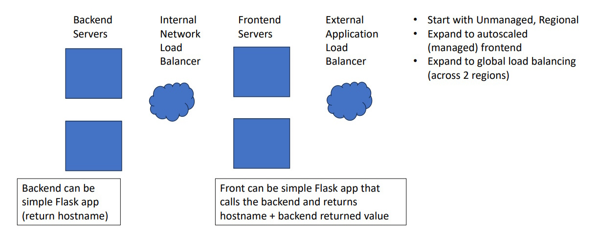

# Sample Web Service Lab (Ungraded)

## Overview

This lab exercise is designed to help you build a sample web service with a focus on infrastructure, particularly load balancing, within Google Cloud Platform (GCP). The lab guides you through creating a simple web service, setting up various types of load balancers, and scaling the infrastructure from a regional setup to a global one.

## Lab Objectives

1. **Understand Load Balancing**: Implement internal and external load balancers in GCP.
2. **Create a Simple Web Service**: Build a basic Flask application for both frontend and backend servers.
3. **Explore Autoscaling**: Learn how to autoscale the frontend servers.
4. **Implement Global Load Balancing**: Expand the setup to handle traffic across multiple regions.

## Lab Setup

### Components

- **Backend Servers**:
  - These are simple Flask applications that return the hostname of the server.
  - This setup simulates content servers and allows you to identify which backend server handled the request.

- **Internal Network Load Balancer**:
  - Distributes traffic among backend servers.
  - This load balancer is likely leveraging Google's Andromeda platform.

- **Frontend Servers**:
  - These are also Flask applications that make requests to the backend servers via the internal load balancer.
  - They return their own hostname along with the hostname returned by the backend, allowing you to trace the request flow.

- **External Application Load Balancer**:
  - Connects the frontend servers to the outside world and distributes incoming traffic to the appropriate frontend server.

### Step-by-Step Instructions

1. **Start with an Unmanaged, Regional Setup**:
   - Set up your infrastructure with unmanaged instance groups within a single region.
   
2. **Expand to Autoscaled (Managed) Frontend**:
   - Introduce autoscaling to automatically adjust the number of frontend instances based on load.

3. **Expand to Global Load Balancing**:
   - Scale your setup to include global load balancing across two regions, enabling geographic distribution of requests.

### Suggested Exercises

- **Benchmarking**:
  - Use benchmarking tools or custom scripts to generate a high volume of HTTP requests.
  - Observe how the load balancers distribute traffic and handle scaling.

### Lab Expectations

This lab is not graded, but it includes a reflective question to help you think critically about the concepts you've learned. The primary focus is on building and understanding the infrastructure rather than the content of the web service itself.

## Conclusion

By the end of this lab, you should have a solid understanding of setting up and managing load balancing and autoscaling in a cloud environment. This exercise emphasizes the importance of infrastructure in building scalable and reliable web services.

